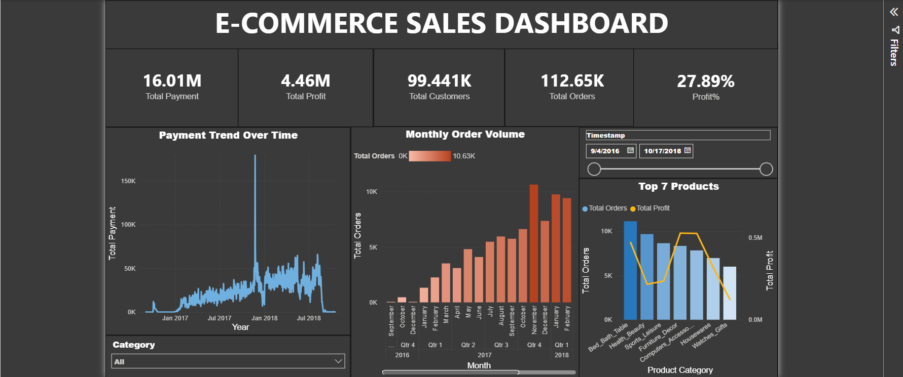
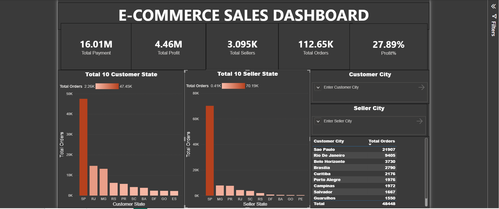

# 📊 E-Commerce Sales & Regional Performance Dashboard

An interactive, 2-page executive Power BI dashboard analyzing $16.01M in total sales volume across 112,000+ customer orders.

## 📸 Dashboard Previews

### Page 1: Sales & Product Profitability

### Page 2: Regional & Seller Concentration

---

## 💡 Key Business Insights

- **Profitability vs. Volume:** `Bed_Bath_Table` leads in total order volume (\~11K orders), but `Computers_Accessories` drives significantly higher net profit (\~$0.5M) despite fewer units sold.
- **Regional Concentration:** Over 40% of customer orders and seller distribution are heavily concentrated in São Paulo (`SP`).
- **Revenue Spikes:** Detailed trend analysis captured a massive Q4 sales spike driven by seasonal promotional campaigns.

---

## 🛠️ Technical Stack & Methods

- **Data Visualization & Analytics:** Power BI, DAX Measures, Dual-Axis Visuals, Dynamic Slicers.
- **Data Engineering:** SQL & Pandas (Data cleaning, handling missing values, type conversions).
